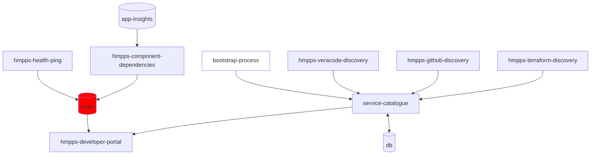

# hmpps-developer-portal

[](https://github-community.service.justice.gov.uk/repository-standards/hmpps-developer-portal)
[![Pipeline [test -> build -> deploy]](https://github.com/ministryofjustice/hmpps-developer-portal/actions/workflows/pipeline.yml/badge.svg?branch=main)](https://github.com/ministryofjustice/hmpps-developer-portal/actions/workflows/pipeline.yml)

A portal to expose useful information to developers.



# Instructions

## Running the app

The easiest way to run the app is to use docker compose to create the service and all dependencies.

`docker-compose pull`

`docker-compose up`

### Dependencies

The app requires:

- hmpps-auth - for authentication
- redis - session store and token caching

## Imported types

The TypeScript types for Strapi are imported via the Open API (Swagger) docs.

These are stored in [`./server/@types/`](./server/@types/).

The Swagger document is downloaded from the running service catalogue and the types can be generated by running:
`./generate-strapi-types.sh`

### Importing types manually
You can download the Swagger document manually with:

`curl -L https://service-catalogue.hmpps.service.justice.gov.uk/v1/swagger.json -o ./full_documentation.json`

We can then run the relevant command to create the types file

```
npx openapi-typescript full_documentation.json --output ./server/@types/strapi-api.d.ts
```

The downloaded file will need tidying (e.g. single rather than double quotes, etc):

- `npm run lint-fix` should tidy most of the formatting
- there may be some remaining errors about empty interfaces; these can be fixed be either removing the line or putting `// eslint-disable-next-line @typescript-eslint/no-empty-interface` before.

After updating the types, running the TypeScript complier across the project (`npx tsc`) will show any issues that have been caused by the change.

### Running the app for development

To start the main services excluding the example typescript template app:

`docker-compose up --scale=app=0`

Install dependencies using `npm run setup`, ensuring you are using `node v24.x` and `npm v11.x`

Note: Using `nvm` (or [fnm](https://github.com/Schniz/fnm)), run `nvm install --latest-npm` within the repository folder to use the correct version of node, and the latest version of npm. This matches the `engines` config in `package.json` and the CircleCI build config.

And then, to build the assets and start the app with nodemon:

`npm run start:dev`

### Run linter

`npm run lint`

### Run tests

`npm run test`

### Running integration tests

For local running, start a test db, redis, and wiremock instance by:

`docker-compose -f docker-compose-test.yml up`

The tests seed the synthetic redis data themselves via a Cypress task, so no manual seeding step is needed.

Then run the server in test mode by:

`npm run start-feature` (or `npm run start-feature:dev` to run with nodemon)

The tests run against synthetic service catalogue data served by wiremock from
`docker/wiremock/mappings/` - no VPN or catalogue token is needed. Any request
without a stub falls through to a proxy mapping pointing at the dev service
catalogue, so you can browse real data through the same setup by connecting to
the VPN and running the app with a `SERVICE_CATALOGUE_TOKEN`. Set
`WIREMOCK_SERVICE_CATALOGUE_URL`/`WIREMOCK_ALERTMANAGER_URL` before starting the
containers to point the proxies elsewhere.

And then either, run tests in headless mode with:

`npm run int-test`

Or run tests with the cypress UI:

`npm run int-test-ui`

### Dependency Checks

The template project has implemented some scheduled checks to ensure that key dependencies are kept up to date.
If these are not desired in the cloned project, remove references to `check_outdated` job from `.circleci/config.yml`

### Port forward to redis hosted in Cloud-platform

This is useful to do so you can test changes with real redis data containing health/info/version stream data.

Create a port forward pod:

```bash
kubectl \
  -n hmpps-portfolio-management-dev \
  run port-forward-pod \
  --image=ministryofjustice/port-forward \
  --port=6379 \
  --env="REMOTE_HOST=[redis host]" \
  --env="LOCAL_PORT=6379" \
  --env="REMOTE_PORT=6379"
```

Use kubectl to port-forward to it:

```bash
kubectl \
  -n hmpps-portfolio-management-dev \
  port-forward \
  port-forward-pod 6379:6379
```

Ensure following redis environment variables are set:

```bash
export REDIS_HOST=127.0.0.1
export REDIS_TLS_ENABLED=true
export REDIS_TLS_VERIFICATION=false
export REDIS_AUTH_TOKEN=[access token]
```


### Port forward to alertmanager endpoint hosted in Cloud-platform

For local developement and testing connections the alertmanager API endpoint.

Create a port forward pod:

```bash
kubectl \
  -n hmpps-portfolio-management-dev \
  run port-forward-alertmanager-pod \
  --image=ministryofjustice/port-forward \
  --port=8080 \
  --env="REMOTE_HOST=monitoring-alerts-service.cloud-platform-monitoring-alerts" \
  --env="LOCAL_PORT=8080" \
  --env="REMOTE_PORT=8080"
```

Use kubectl to port-forward to it:

```bash
kubectl \
  -n hmpps-portfolio-management-dev \
  port-forward \
  port-forward-alertmanager-pod 8080:8080
```

Suggested environment vars to use:

```bash
export ALERTMANAGER_API_URL=http://localhost:8080/alertmanager
export PROMETHEUS_API_URL=http://localhost:8080/prometheus
```

Usage with curl e.g:

```bash
curl -v 'http://localhost:8080/alertmanager/alerts?filter=businessUnit="hmpps"'
```
